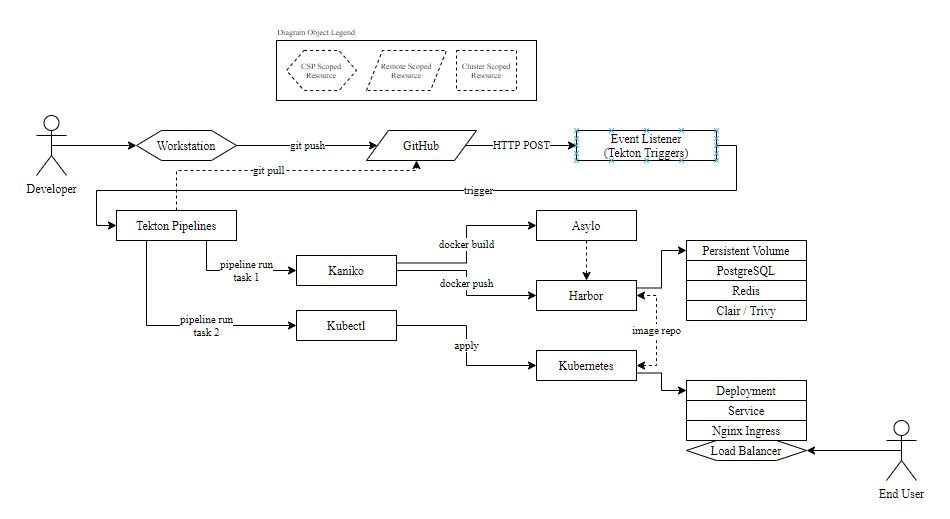

# Cluster-Scoped Kubernetes CI/CD Pipelines in the Cloud with Asylo as a Trusted Execution Environment Abstraction Framework

This work was done in completion of the requirements for JHU EN 605 731 81 SU20 - Survey of Cloud Computing Security (towards fullfilment of a M.S. in Computer Science).

## Project Goals

The idea behind the project (and associated code repository) is to create a K8s CI/CD pipelines of components that live entirely *within* the pipeline (hence "cluster-scoped") and that extends a common CI/CD pipeline by wrapping deployment artifacts with [Asylo](https://asylo.dev), an abstraction framework for creating enclave binaries.

## Getting Started

To start, `cd` into `gcp` and then run `make all`.  There's a bit more too it than that though (but that's the goal, to allow the creation of this *entire* pipeline with `make all`).

> This project currently only runs on Google Cloud, hence the "gcp" directory.  If / when its extended, expect directories such as "azure" or "aws", etc.

> *Why `make`*? - I adopted this structure after seeing a presentation on stage, where the author had combined all of their demo code into a single `Makefile` and created recipe targets for `step1`, `step2`, etc.  It seemed incredibly easy and intuitive, allowing separation and ease.  Its not perfect and has its pitfalls (compared to just shell scripts), but its a personal preference I stick with.

## I Ran `make all`, Now What?

Let's take you through each and every step.  If you check the `Makefile`, you'll see that `all` is a target for a dozen or so different recipes, executing in order.  We can step through each of them.

### `make network`

Nearly all Cloud based resources at the Infrastructure or Platform layer need to live within a VPC.  To do this, we execute a series of `gcloud` commands to:

* Create a new VPC
* Create a subnet in that VPC specific to a region (in this case `us-east-4`)
* Create firewall rules to allow certain types of inbound traffic
* Create a static IP address we can allocate to our clusters Load Balancer later

### `make cluster`

This is a bit of a _magic_ Google SDK command.  With a single command, we can create a highly-available distributed Kubernetes cluster, via [Google Kubernetes Engine (GKE)](https://cloud.google.com/kubernetes-engine).  This will be the foundation for the rest of our commands.

### `make cluster-kaniko`

This one is misleading.  [Kaniko](https://github.com/GoogleContainerTools/kaniko) doesn't actually "install" into our cluster.  However it is going to need permissions to reference and use when it executes, which we create here and expose in the form of Kubernetes [secrets](https://kubernetes.io/docs/concepts/configuration/secret/).

### `make cluster-tekton-pipelines`

This command will `kubectl apply -f` the yaml targets for installing [Tekton Pipelines](https://github.com/tektoncd/pipeline) into our cluster.  Tekton will expose new `Task`, `TaskRun`, `Pipeline`, and `PipelineRun` [custom resources definitions (CRD)](https://kubernetes.io/docs/concepts/extend-kubernetes/api-extension/custom-resources/) into our cluster.  It will also create a [persistent volume](https://kubernetes.io/docs/concepts/storage/persistent-volumes/) necessary for storing some items.

### `make cluster-tekton-triggers`

This is pretty simple, we simply `kubectl apply -f` to install Tekton Triggers, which exposes some new `EventListener` and `TriggerTemplate` related CRDs.

### `make cluster-nginx-ingress`

If we want to expose the [services](https://kubernetes.io/docs/concepts/services-networking/service/) in our cluster to the outside world, we generally will do this via an [ingress](https://kubernetes.io/docs/concepts/services-networking/ingress/).  K8s comes with default ones, and on Google Cloud it will utilize a default [Google Compute Engine Ingress Controller](https://github.com/kubernetes/ingress-gce).  This can be somewhat limiting, so we want to install and use a community version of the [Nginx Ingress Controller](https://github.com/kubernetes/ingress-nginx).

We'll have to create a [clusterrolebinding](https://kubernetes.io/docs/reference/access-authn-authz/rbac/) to allow the Nginx controller to perform internal cluster actions when we want it too.

Critically often forgotten, we're then going to `patch` the new resource to include the IP address of the static IP address we allocated when we ran `make network`.  This will associate the ingress of our cluster with a static IP.  We can update our DNS records (out of scope for this project) to point to this IP address.  We don't de-allocate this IP when we `make clean` and destroy the cluster, which allows us to create and destroy the cluster at will with minimal configuration (in many cases, none at all).

### `make cluster-cert-manager`

This stage will install the `cert-manager` project.  It will bind itself to the ingress controller and be able to automatically issue trusted, real TLS certificates to our endpoints dynamically.

### `make redis`

This command will use [Helm](https://helm.sh/) to create a highly-available installation of [Redis](https://redis.io/) in our cluster.  Redis is an in-memory key/value store that is needed by Harbor.

### `make postgresql-db`

This command will again use Helm to create a highly-available installation of [PostgreSQL](https://www.postgresql.org/) in our cluster.  This DB is also needed for persistent actions, logging, account and identity pieces by Harbor.  Harbor requires certain `tables` to be created when it installs, so we will `sleep` (to wait for our pods to come up) and then additionally use `psql` to automatically create those objects.

### `make harbor`

Again using Helm, we will now install [Harbor](https://goharbor.io/) into the cluster.  A *lot* of the options here are critical, so we'll go over them:

* Our `externalURL` is set for Harbors configuration purposes.  This needs to be set in our DNS Zone / Registrar to point to our static IP allocated earlier, so traffic to Harbor can enter the cluster.
* We're going to use `ingress` (as opposed to `clusterip` or `nodeport`) to route our traffic to Harbor.
* We apply a specific annotation that effectively allows larger containers to be pushed or pulled from the registry
* We define both Redis and PostgreSQL as being "external".  Despite this definition, they are not "external" as the DNS endpoints of the resources are targeted to our internal constructs.  Traffic will never leave the mesh of the cluster.  When set to "internal", Harbor will use its own temporary, non-production ready Redis and PostgreSQL capabilities (which we don't want).

Finally, we annotate the ingress created by Harbor with a cert-manager annotation, which will provision an [ACME](https://letsencrypt.org/) cert for it.  TLS is required here, especially so we don't have to add "insecure-registry" command flags in half-a-dozen different places (and because security is the whole point of this architecture).

### `make pipeline-objects`

Buckle up cause this one is pretty much the meat of the entire project!

#### Tekton Resources

First we create the Tekton `pipelineresource` objects that Tekton will need.  There are two main ones, a `git` resources for where to fetch code from and a `registry` resource for where to push finished objects to.

#### Role / Bindings

Many components of this pipeline will need advanced permissions.  We create a role with the necessary (and *only* the necessary) permissions and then grant access on that role to a service account via a rolebinding.

#### Secrets

When pipeline components `clone` from GitHub and `docker push` to Harbor, they'll need appropriate non-cluster credentials to do so.  These secrets create the accompanying `serviceaccounts` with the proper permissions to do so.

> When recreating this pipeline, you are *required* to change these objects.  Currently the `secrets/` directory has incomplete object checked-in to it, to avoid exposing credentials.

#### Certificates

We set up `staging` and `prod` certificate issuers with ACME / LetsEncrypt.

#### Nginx Pipeline Objects

This will create the `build-and-push` and `deploy` tasks for a basic deployment of an Nginx pod into the cluster, as well as a `pipeline` object that will execute those two actions.

#### Asylo Pipeline Objects

These files are largely replicated from the Nginx pipeline, just specific to our Asylo deployment files within the respository.

#### Tekton Triggers

Both the Nginx and Asylo pipelines will be triggered off of similar event pipelines.

## Cleaning Up

Run `make clean`.  That's it!  This will delete *everything*, with the notable exception of leaving the allocated static IP address intact.  This allows us to recreate the entire pipeline with `make all` and maintain our DNS structure.  If we delete the static IP (which you can absolutely do), then the next time `make all` is run the pipeline will allocate a new static IP, which will need to be updated with any DNS zone targets you have.
